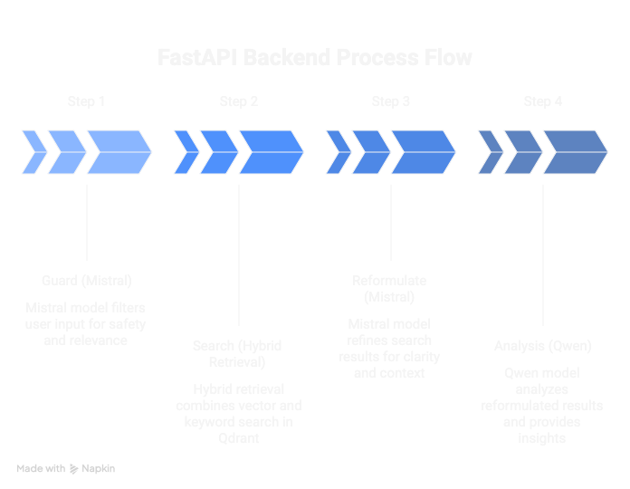
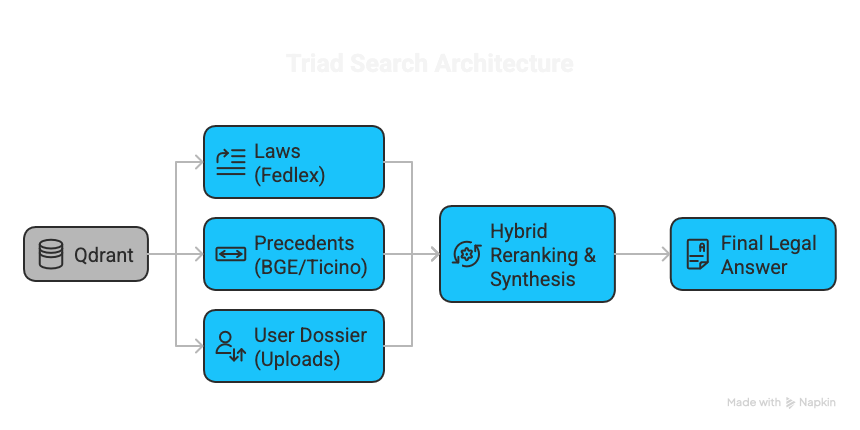
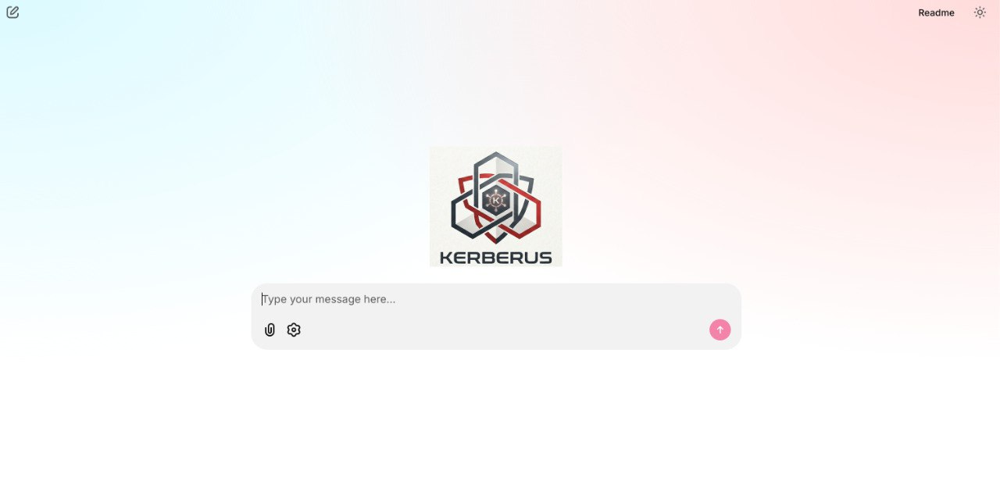
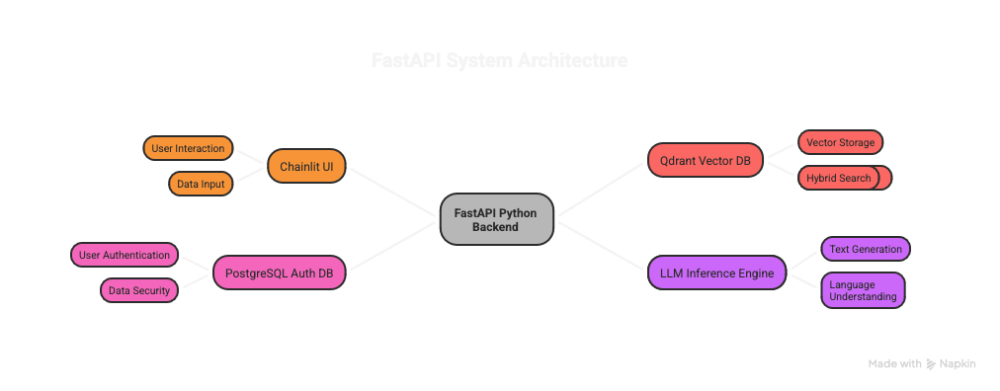

# 🛡️ KERBERUS - Open Source Legal Intelligence for Switzerland

> **Status:** 🚧 In Active Development | Expected Release: February 2026

A production-grade AI legal assistant for Swiss lawyers, built with zero-knowledge encryption, multilingual support(DE/FR/IT) and full data sovereignty.

[](https://opensource.org/licenses/MIT)
[](https://www.python.org/downloads/)

---
<div align="center">
  
  
  <h3>Open Source Legal Intelligence for Switzerland</h3>
  
  <p>
    <a href="https://opensource.org/licenses/MIT">
      
    </a>
    <a href="https://www.python.org/downloads/">
      
    </a>
  </p>
</div>

## 🎯 Why This Project?

After my previous company closed in January 2026, I invested the transition period in building something meaningful: a production-grade legal AI assistant demonstrating end-to-end LLM application development.

**Project Origin: Applied LLMOps**

This project was built to rigorously apply the advanced concepts from the **LLMOps Specialization (Duke University)** to a real-world, high-stakes domain.

Instead of a theoretical exercise, KERBERUS focuses on:
1. **Production-Grade RAG**: Implementing hybrid search, rescording, and dynamic context management.
2. **Sovereign AI Infrastructure**: Hosted on **Infomaniak** (Switzerland) to strictly avoid US CLOUD Act jurisdiction. Unlike US hyperscalers (AWS/Azure), this architecture ensures 100% compliance with Swiss Data Protection laws (nFADP) and GDPR by keeping compute and data physically within Switzerland.
3. **End-to-End MLOps**: Automated ingestion pipelines, monitoring, and reproducible deployment.

I chose to open-source this reference implementation because:
- ✅ Developers building compliance AI can learn from a complete reference implementation
- ✅ Showcases capabilities beyond typical take-home assignments or coursework
- ✅ Adaptable to any civil law jurisdiction (Germany, Austria, France, etc.)
- ✅ More valuable to my career than a minimally-viable commercial product

**What makes this interesting:**
- ✅ Processes **400,000+ judgments** across 4 jurisdictions (Federal, TI, BS, VD)
- ✅ **Zero-knowledge encryption** - data stays in Switzerland and is always encrypted
- ✅ **Production-grade architecture** - handles 50+ concurrent users with <5s P95 latency
- ✅ **Validated by Swiss lawyers** - tested against commercial legal AI platforms
- ✅ **Fully open source** - adapt for your jurisdiction or learn from the implementation

---

## 🏗️ Architecture

<div align="center">
  
</div>

### **Core Components**

**Infrastructure:**
- Docker-orchestrated services (Qdrant, PostgreSQL, Redis)
- **Auto GPU detection** (CUDA → MPS → CPU fallback)
- Apple Silicon optimized for local development
- Production deployment ready (Infomaniak with GPU)

**Three-Stage LLM Pipeline:**
```
User Query → Mistral 1 (Guard) → Search → Mistral 2 (Reformulate) → Qwen (Analyze)
```
- **Stage 1: Guard & Enhance** - Security check + query optimization (Mistral)
- **Stage 2: Search & Rerank** - Hybrid retrieval + full document fetch
- **Stage 3: Reformulate** - Structure query for legal analysis (Mistral)
- **Stage 4: Legal Analysis** - Full analysis with dual-language citations (Qwen)

**Advanced RAG Pipeline:**
- **BGE-M3 Hybrid Embeddings** - Dense (1024-dim semantic) + Sparse (lexical/BM25-like) with Reciprocal Rank Fusion (RRF)
- **BGE-Reranker-v2-M3** - Cross-encoder precision ranking (processes query+document jointly for accurate relevance scoring)
- **Recency weighting** - Recent precedents scored higher via normalized year scoring
- **Authority weighting** - Supreme Court (BGE/ATF) cases prioritized
- **Calibrated MMR** - λ=0.85 optimized diversity/relevance balance to preserve Cantonal decisions while removing duplicates
- **Triad search** - Parallel search across laws (Codex), case law (Library), and user dossiers
- **Deep Search Pipeline** - 250 candidates → MMR (20 diverse) → Rerank (score all) → Deduplicate (10 unique documents)
- **Full document retrieval** - Chunks are for finding; Qwen receives complete decisions/laws (regeste, facts, reasoning, decision) for accurate legal analysis

<div align="center">
  
</div>

### 💰 Cost & Context Optimization: The "Sliding Window"
Standard RAG systems suffer from **"Context Poisoning"**: they blindly append new retrieved documents to the chat history.
* **The Problem:** If a user asks about *Theft* (Turn 1) and then *Sick Leave* (Turn 2), a standard RAG keeps the "Theft" laws in the context window. The LLM gets confused by conflicting regulations and token costs double.
* **The Kerberus Solution:** We decouple **Conversational Memory** from **Knowledge Retrieval**.

**The Mechanism:**
1.  **Chat History (Immutable):** We keep the full dialogue (`User: "Can I fire him?"`) so the LLM understands pronouns like "him" refer to the employee discussed in Turn 1.
2.  **Reference Context (Ephemeral):** We **swap** the legal documents completely for every new turn.

**Real-World Example:**
```python
# --- Turn 1: User asks "Can I fire an employee for stealing?" ---
# Chat History: ["User: Fire for stealing?"]
# Retrieved Context: [Art. 337 OR (Immediate Dismissal)]
# Result: LLM answers regarding theft.

# --- Turn 2: User asks "What if he is on sick leave?" ---
# 1. We read History -> We know "he" = the employee from Turn 1.
# 2. We SEARCH for "Sick Leave" laws.
# 3. We SWAP the context:
#    - REMOVE: [Art. 337 OR] (Theft rules are now irrelevant noise)
#    - INSERT: [Art. 336c OR] (Protection against termination at untimely execution)

# Result: High precision, zero token bloat, no conflicting legal contexts.

**Data Ingestion:**
- Incremental scraping with state management
- Smart year-range detection (avoids re-downloading)
- Rate limiting and retry logic
- Ticino scraper: ~30,000 judgments (1990-present)
- BGE/ATF scraper: ~150,000 published federal decisions
- Fedlex scraper: Active federal laws and ordinances (OR, ZGB, StGB, etc.) — dynamically synchronized to purge repealed legislation

---

## 🔍 Technical Highlights

### **Metadata-Driven Ranking**

Every judgment is enriched with structured metadata:
```python
{
    "case_id": "BGE_140_III_348",
    "year": 2014,
    "court": "bundesgericht",
    "source": "bge_archive",
    "is_cornerstone": True,
    "authority": "SUPREME_PUBLISHED",
    "law_type": "civil",
    "domain": "employment",
    "outcome": "REJECTED",
    "cites_cases": ["BGE_135_III_232", ...],
    "cites_articles": ["Art. 337 OR", ...]
}
```

### **Intelligent Reranking**
```python
final_score = base_rerank_score 
              + (0.10 × recency_score)
              + (0.10 × authority_boost)
```

This ensures recent, authoritative precedents surface first while maintaining semantic relevance.

---

## 🚀 Current Status & Roadmap

### **✅ Completed**
- Production infrastructure (Docker, Qdrant, PostgreSQL, Redis)
- **Hybrid Search Engine** (Dense + Sparse Retrieval) with Reciprocal Rank Fusion (RRF)
- Multilingual BGE-M3 Embeddings (Dense 1024d + Sparse Lexical Weights)
- Qdrant Vector Database population (Laws + Case Law)
- Dynamic context swapping implementation
- Triad search architecture
- Ticino court scraper with incremental updates
- BGE/ATF scraper (Federal Supreme Court published decisions)
- Fedlex scraper (Swiss federal laws - OR, ZGB, StGB) with auto-repeal handling
- Parsing Engine (PDF/HTML -> JSON)
  - Metadata extraction (Judges, Dates, Outcomes)
  - Legal citation linking (e.g. `Art. 337 OR` -> `SR 220`)
  - Intelligent section splitting (Facts vs. Reasoning)
- **Authentication System** (PostgreSQL-backed)
  - User registration with bcrypt password hashing
  - Session management with secure tokens
  - Token usage tracking for billing
- **Multi-Factor Authentication (MFA)**
  - TOTP-based (compatible with Google Authenticator, Authy)
  - QR code generation for easy setup
  - Backup codes for account recovery
- **Encrypted Dossier Storage** (SQLCipher)
  - AES-256 encrypted user document storage
  - Per-user isolated databases
  - Integration with Qdrant for semantic search
- **Chainlit Conversational Interface**
  - Dual-collection search (Laws + Case Law)
  - Multilingual mode toggle for cross-language queries
  - Real-time search with filters (year, language, scope)

<div align="center">
  
</div>

- **Three-Stage LLM Pipeline**
  - Mistral 1: Guard & Enhance (security + query optimization)
  - Mistral 2: Query Reformulator (structures request for Qwen)
  - Qwen: Full Legal Analysis with dual-language citations
  - Traffic light consistency indicator (CONSISTENT/MIXED/DIVERGENT)
  - Links to Fedlex and BGer sources
  - Risk assessment and practical guidance
- **FastAPI REST API**
  - Bearer token authentication
  - Search endpoints (laws, decisions, combined)
  - Chat endpoint with streaming support (SSE)
  - Rate limiting (50/hour, 300/day)
  - OpenAPI documentation at `/docs`
- **Security Hardening**
  - HTTP security headers (X-Frame-Options, CSP, X-Content-Type-Options, etc.)
  - Proper session invalidation on logout
  - Password change endpoint with session management
  - Account lockout after failed login attempts (brute force protection)
  - IP-based rate limiting for authentication endpoints
- **PII Detection & Scrubbing** (Presidio-based)
  - Swiss-specific recognizers (AHV numbers, Swiss phone/IBAN)
  - Automatic query scrubbing before LLM processing
  - API endpoints for PII checking and scrubbing
  - Configurable entity types and confidence thresholds
- **Dossier API** (Document Management)
  - Upload documents (PDF, DOCX, TXT) to encrypted storage
  - Automatic parsing, chunking, and embedding
  - PII scrubbing before storage
  - Hybrid search across user's documents
- **Tabular Document Review** (New!)
  - **Schema-Driven Extraction**: Automatically extracts fields from documents based on presets
  - **Specialized Presets**:
    - 📄 **Contract Review** (Term, Termination, Indemnity)
    - 👔 **Employment Contracts** (Salary, Non-Compete, Benefits)
    - 🔒 **NDA Review** (Confidentiality Period, Exclusions)
    - 🔍 **Due Diligence** (Change of Control, Assignability)
  - **Excel Export**: Download structured review data for offline analysis
  - **Citation Tracking**: Every extracted value links back to source text
  - **Review Chat**: Q&A across the entire document set

## 🛠️ Usage

### **Data Ingestion (Scraping)**
```bash
# Federal Laws (Fedlex) - Syncs latest versions & deletes repealed ones
make scrape-fedlex

# Ticino Court Decisions
make scrape-ticino        # Incremental update

# Federal Court Decisions
make scrape-federal
```

### **Data Processing & Embedding**
Transform raw data into searchable Hybrid Vectors:
```bash
# 1. Parse raw files to JSON
make parse-federal
make parse-ticino

# 2. Generate Hybrid Embeddings (Dense + Sparse)
make embed-fedlex    # Embed Laws
make embed-decisions # Embed Court Decisions (Federal & Ticino)
```

### **Search**
Test the Hybrid Search Engine:
```bash
python scripts/test_search.py
```

### **REST API**

<div align="center">
  
</div>

Start the FastAPI server:
```bash
# Development (with hot reload)
make api

# Production
make api-prod
```

API endpoints available at `http://localhost:8000`:
- `POST /auth/register` - Register new user
- `POST /auth/login` - Get access token
- `POST /auth/logout` - Invalidate session
- `POST /auth/password/change` - Change password
- `POST /auth/mfa/setup` - Initialize MFA setup
- `POST /search` - Search laws and decisions
- `POST /chat` - Full legal analysis
- `POST /chat/stream` - Streaming analysis (SSE)
- `POST /security/pii/check` - Check text for PII
- `POST /security/pii/scrub` - Scrub PII from text
- `POST /dossier/documents` - Upload document to encrypted dossier
- `POST /dossier/documents/list` - List user's documents
- `POST /dossier/documents/{id}` - Get document details
- `DELETE /dossier/documents/{id}` - Delete document
- `POST /dossier/search` - Search user's dossier
- `POST /dossier/stats` - Get dossier statistics
- `GET /docs` - OpenAPI documentation

## 🎥 Demo

**Coming Soon:** Video walkthrough and hosted demo

### **🚧 In Progress**
- Production deployment on Infomaniak
- Embedding pipeline (populate Qdrant with parsed data)

### **🔜 Next**
- Firm management (shared dossiers, role-based access)
- Token usage billing and rate limiting

### **🔮 Future**
- Citation graph analysis (identify landmark cases)
- Multi-canton expansion
- React frontend
- Adaptation guides for other countries

---

## 🌍 International Applicability

While built for Switzerland, KERBERUS can be adapted to any civil law jurisdiction with public legal databases:

- 🇩🇪 Germany (bundesgerichtshof.de)
- 🇫🇷 France (legifrance.gouv.fr)
- 🇸🇪 Sweden (domstol.se)
- 🇦🇹 Austria (ris.bka.gv.at)
- 🇧🇪 Belgium (juridat.be)
- 🇳🇱 Netherlands (rechtspraak.nl)

Requires replacing scrapers and adapting metadata schema for local court hierarchies.

---

## 📚 Tech Stack

| Component | Technology |
|-----------|-----------|
| **Embeddings** | BGE-M3 (1024d Dense + Sparse Lexical, auto GPU detection) |
| **Reranking** | BGE-Reranker-v2-M3 |
| **Vector DB** | Qdrant (Hybrid Search with RRF) |
| **Auth DB** | PostgreSQL 15 |
| **Encrypted Storage** | SQLCipher (AES-256) |
| **Authentication** | bcrypt + TOTP (MFA) |
| **LLM** | Qwen3-VL (235B) & Mistral-Small-3.2-24B |
| **Deployment** | Docker + Infomaniak |
| **Frontend** | Chainlit (conversational UI) |
| **Testing** | pytest (68+ tests covering security, PII, dossier, embedder, reranker) |

---

## 🔐 Security & Privacy

- **Zero-knowledge encryption** - SQLCipher AES-256, keys derived from user password (we cannot decrypt without user)
- **MFA authentication** - TOTP-based (Google Authenticator compatible) + backup codes
- **Session security** - Cryptographically secure tokens, automatic expiration, proper logout invalidation
- **Brute force protection** - Account lockout after failed attempts, IP-based rate limiting
- **Security headers** - X-Frame-Options, CSP, X-Content-Type-Options, Referrer-Policy
- **PII detection & scrubbing** - Presidio-based with Swiss-specific recognizers (AHV, phone, IBAN)
- **Swiss data sovereignty** - All infrastructure hosted in Switzerland (Infomaniak)
- **GDPR compliant** - By design, no third-party tracking
- **Password security** - bcrypt with 12 rounds, secure password verification, self-service password change

---

## 🤝 Contributing

Contributions welcome! Whether you want to:
- Adapt for your country
- Report bugs
- Suggest features
- Improve documentation
```bash
git clone https://github.com/brani-milo/kerberus
cd kerberus
make setup
make scrape-ticino-test  # Test with 1993 only
```

---

## 💼 About the Author

I'm **Branisa Milosavljevic**, a Data Scientist with **7+ years** driving business growth through AI/ML at companies like Medical Insights (Basel), Enterprise Mobility (Zurich), and Kambi (Stockholm).

**This project demonstrates:**
- LLMops application development (RAG, embeddings, reranking)
- Production system design (Docker, Qdrant, PostgreSQL, Redis)
- MLOps maturity (incremental scraping, monitoring, deployment)
- Security engineering (zero-knowledge, encryption, PII detection)
- Swiss market expertise (FINMA compliance, data sovereignty)

**Looking for:**
- (Senior) Data Scientist roles (Switzerland or Full Remote)
- AI Engineer positions (product-focused, end-to-end ownership)
- AI Transformation Lead or Consultant (organizational change, AI adoption strategy)

---

## 📄 License

MIT License - See [LICENSE](LICENSE)

**TL;DR:** Free to use, modify, and commercialize without restriction.

**If this helped your project:** Please consider citing or linking back to this repo. It helps others discover the work and supports the open-source community.
```bibtex
@software{milosavljevic2026kerberus,
  author = {Milosavljevic, Branisa},
  title = {KERBERUS: Swiss Legal AI Assistant},
  year = {2026},
  url = {https://github.com/brani-milo/kerberus}
}
```

---

## 🙏 Acknowledgments

Built during my job search (January 2026 - present). This project represents:
- Production-grade LLM application development
- LLMOps certification applied to real-world problems
- 7+ Years experience in Data Science

### Special Thanks

**[Entscheidsuche.ch](https://entscheidsuche.ch/)** - This project would not be possible without the incredible work of the Entscheidsuche.ch team. They have built and maintain the scrapers that collect Swiss court decisions, and provide open access to this invaluable legal data. Their commitment to making Swiss case law accessible is a cornerstone of legal transparency in Switzerland.

**[Claude Code](https://claude.ai/claude-code)** - Parts of the frontend interface and MFA implementation were developed with assistance from Claude Code, Anthropic's AI-powered development tool. This project embraces modern AI-assisted development practices to accelerate delivery while maintaining code quality.
## ⚠️ Project Status & Disclaimer

**This is a portfolio/demonstration project built to showcase:**
- End-to-end LLM application development skills
- Application of LLMOps certification
- Production-grade system design and architecture capabilities

**Important clarifications:**
- ✅ This project has **never been commercialized** and has generated **zero revenue**
- ✅ Built solely as a **demonstration of technical capabilities** for job applications
- ✅ All code is provided **as-is for educational and reference purposes**

**Legal Disclaimer:**
This software is provided under the MIT License (see LICENSE file). It is not intended as legal advice and should not be used for actual legal practice without proper review, testing, and compliance verification. The author assumes no liability for any use of this software. Always consult qualified legal professionals for legal matters.

---

**⭐ Star this repo if you find it useful!**

**Expected release: February 2026**
