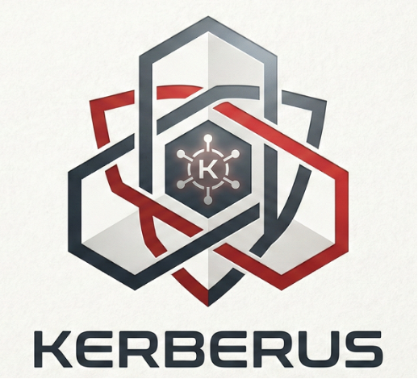
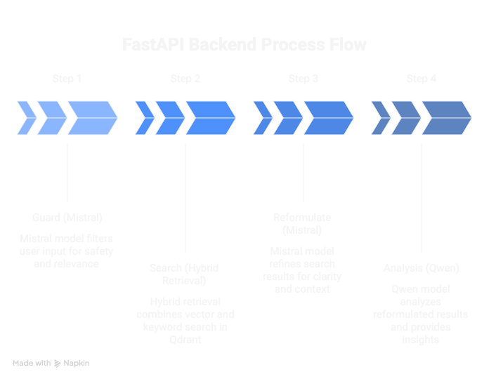
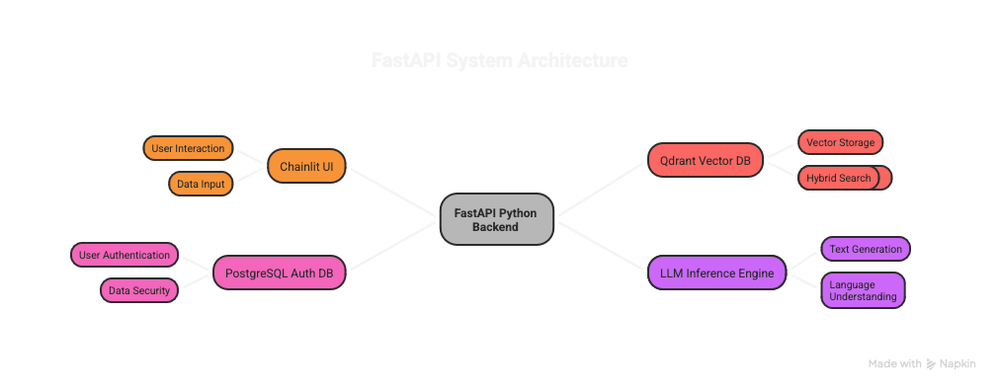

<div align="center">
  

  # KERBERUS

  **Open-source legal research assistant for Swiss law (DE / FR / IT)**

  Hybrid retrieval over federal laws and court decisions, a guarded three-model LLM pipeline,
  encrypted client dossiers, and Swiss-hosted inference.

  [](LICENSE)
  [](https://www.python.org/downloads/)
  [](.github/workflows/ci.yml)
</div>

---

## What it does

A lawyer asks a question in German, French or Italian. KERBERUS:

1. scrubs personal data from the question (Swiss AHV, IBAN, phone numbers, names),
2. checks it with a small guard model and rewrites it for retrieval,
3. searches laws (Fedlex) and case law (Federal Supreme Court, Federal Administrative Court, cantonal courts) with
   dense + lexical vectors, re-ranks with a cross-encoder and keeps only sources that are actually relevant,
4. hands the **full text** of the surviving articles and decisions to a large model,
5. returns a structured analysis with verbatim, dual-language citations, a consistency indicator and next steps.

Everything runs on infrastructure you control. Inference goes to [Infomaniak AI](https://www.infomaniak.com/en/hosting/ai-tools)
in Switzerland; nothing leaves the country.

> **Status:** working demo used by a small group of Swiss lawyers for evaluation. It is a portfolio and reference
> project, not a product. See the [disclaimer](#disclaimer) before relying on any output.

---

## Quickstart

Requirements: Docker, Python 3.13, `libsqlcipher` (macOS: `brew install sqlcipher`), an Infomaniak AI API key
(without one the pipeline runs in mock mode).

```bash
git clone https://github.com/brani-milo/kerberus && cd kerberus
make setup                      # venv + dependencies + .env from .env.example
# edit .env: INFOMANIAK_PRODUCT_ID, INFOMANIAK_API_KEY, CHAINLIT_AUTH_SECRET, POSTGRES_PASSWORD
make start                      # Qdrant, PostgreSQL, Redis, model service, UI and API (docker compose)
make db-init                    # schema migrations + Qdrant collections
```

Then ingest some data (see [Data pipeline](#data-pipeline)) and open:

| Service | URL |
|---|---|
| Chainlit UI | http://localhost:8000 |
| REST API + OpenAPI docs | http://localhost:8001/docs |
| Model service | http://localhost:8080/health |
| Qdrant dashboard | http://localhost:6333/dashboard |

For local development without Docker for the app itself: `make chainlit` (UI on :8501) or `make api` (API on :8000).
Scripts run from your machine need `QDRANT_HOST=localhost POSTGRES_HOST=localhost` in front of them if `.env`
uses the compose service names.

---

## Architecture

<div align="center">
  
</div>

### Query pipeline

```
question ─► PII scrub ─► Guard & Enhance ─► Triad search ─► Reformulate ─► Context ─► Analysis
              Presidio     Mistral Small       Qdrant +        Mistral Small   full texts    Qwen3-235B
                                               reranker
```

One implementation, [`src/pipeline/service.py`](src/pipeline/service.py), produces an event stream that both the
Chainlit UI and the REST API consume. Authentication rules (lockout, MFA, password policy, key rotation) live in
[`src/auth/service.py`](src/auth/service.py) for the same reason: every behaviour exists exactly once.

**Stage 1 – Guard & Enhance.** Detects language and prompt injection, expands vague questions, flags follow-ups so
the previous sources can be reused without a new search.

**Stage 2 – Triad search** ([`src/search/triad_search.py`](src/search/triad_search.py)). Three lanes run in
parallel: laws, decisions, and the user's encrypted dossier.

| Step | Laws (Codex) | Decisions (Library) |
|---|---|---|
| Hybrid retrieval (dense + sparse, RRF) | 400 candidates | 500 candidates |
| MMR (λ = 0.98, relevance normalised) | 80 | 100 |
| Cross-encoder rerank on **full chunk text** | 60 | 100 |
| Deduplicate | per article (paragraphs collapse) | per decision (best chunk) |
| **Relevance gate** | ≤ 15 laws + ≤ 10 ordinances | ≤ 15 |
| Full-text enrichment | article + law name + hierarchy | regeste, facts, reasoning, decision |

The relevance gate is the piece that keeps unrelated law out of the prompt. The reranker returns raw logits;
calibrated on Swiss legal text, on-point articles score around −6 … +3, tangential ones −6 … −8, unrelated ones
below −10. Anything more than `RERANK_TOP_MARGIN` (7) logits below the best hit, or below `RERANK_MIN_LOGIT` (−9),
is dropped; ordinances are gated against the best *law*; a lane whose best hit is itself weak contributes at most
three `[relevance: low]` sources. Quotas are ceilings, never targets.

The dense query vector is computed from the user's question alone. Domain expansion (e.g. *Baubewilligung* →
RPG, NHG, GSchG) only feeds the lexical vector, so recall improves without dragging the semantic search into
neighbouring fields.

**Neighbour expansion.** For the best law hits, the articles immediately before and after are pulled from the
document store and added as `[relevance: context]` sources. Articles on one topic sit together (OR 340 … 340c), and this
recovers the ones first-stage retrieval missed, including articles whose vectors were built from an imperfect parse.

**Stage 3 – Reformulate.** Restates the facts, dates and amounts from the question and the tasks requested.

**Stage 4 – Context.** Every source is labelled with the law's name, its position in the systematic collection and a
`[relevance: high|medium|low]` tag. Full decisions are budgeted per document and in total
(`MAX_DECISION_CHARS`, `MAX_DECISIONS_CONTEXT_CHARS`), with the regeste always kept and reasoning prioritised.

**Stage 5 – Analysis.** Qwen3-235B, streamed. The prompts (DE/FR/IT/EN) require verbatim quotes with the original
text, forbid citing SR numbers that are not in the sources, tell the model to omit unrelated sources rather than
mention them, and demand that a conclusion reuse the exact figures computed in earlier steps and state a calendar
end date whenever a duration is calculated.

### Conversation memory

Chat history is kept across turns so pronouns resolve; the retrieved legal context is replaced on every new
question. A follow-up ("what if he is on sick leave?") reuses the previous sources; a new topic gets a fresh search.
Token cost stays flat over long conversations.

### Storage

| Store | Contents |
|---|---|
| **Qdrant** | `codex` (law articles) and `library` (decision chunks): dense 1024-d + sparse vectors, metadata, full chunk text |
| **PostgreSQL** | users, sessions, usage, wrapped dossier keys, the **document store** (full decisions and laws keyed by id, citation and normalised aliases), encrypted conversation history |
| **SQLCipher** | one AES-256 database per user for uploaded documents (envelope-encrypted, see below) |
| **Redis** | rate limits, pending MFA secrets |

The document store replaces per-request filesystem lookups. Load it with `make load-documents` after each parse
run; if it is unreachable the app falls back to an in-memory index of the parsed JSON files.

### Model service

[`src/services/models_api.py`](src/services/models_api.py) hosts BGE-M3 and BGE-Reranker-v2-M3 once for all
replicas (`MODEL_SERVICE_URL`). Without it, each process loads the models itself (CUDA → MPS → CPU auto-detect).
Set `HF_HUB_OFFLINE=1` once the weights are cached so a stalled CDN connection cannot block start-up.

### Security

- **Envelope-encrypted dossiers.** Each user gets a random 256-bit data key; SQLCipher opens with it as a raw key.
  The data key is wrapped with a PBKDF2-derived key from the password and stored in `dossier_keys`. Changing the
  password re-wraps the key instead of orphaning the dossier; legacy password-keyed dossiers migrate on first unlock.
- **Authentication.** bcrypt passwords, opaque session tokens in PostgreSQL, mandatory TOTP MFA with one-time backup
  codes, lockout after five failed attempts, IP rate limits on login and registration. The TOTP secret never leaves
  the server.
- **PII scrubbing** (Presidio + Swiss recognisers) before any text reaches a model; unsupported languages fall back to
  the German analyser so pattern recognisers still run.
- **Transport and headers.** CSP, frame and content-type protections on the API; HTML from retrieved documents is
  escaped, model output is stripped of active HTML before rendering.
- **Secrets** via environment or Docker secrets files (`*_FILE`); never in the repository or the image.
- Self-registration through the UI can be switched off with `ALLOW_SELF_REGISTRATION=false`.

---

## Data pipeline

```
scrape ──► parse ──► load document store ──► embed ──► (backfill for older indexes)
```

```bash
make scrape-fedlex          # federal laws and ordinances (repealed acts are purged)
make scrape-federal         # Federal Supreme / Administrative / Criminal Court decisions
make scrape-ticino          # Ticino cantonal courts, incremental

make parse-fedlex           # PDF -> articles with hierarchy metadata
make parse-federal
make parse-ticino

make load-documents         # parsed JSON -> PostgreSQL document store
make embed-fedlex           # -> Qdrant "codex"
make embed-decisions        # -> Qdrant "library"
make backfill-chunk-text    # add full text to points embedded before v0.3 (no re-embedding)
```

**Where the vectors live.** The decision embeddings (Federal Supreme Court, Federal Administrative Court, Ticino) and
the Ticino cantonal laws were produced on Modal and are stored in the Modal volume `kerberus-data` under
`/embeddings/…`, next to `parsed.tar.gz` (every parsed decision) and `parsed_fedlex.tar.gz`. They are imported, not
recomputed:

```bash
modal volume get kerberus-data /embeddings/library/ticino data/embeddings/library/ticino
QDRANT_HOST=localhost python scripts/import_embeddings_local.py --collection library --embeddings-dir data/embeddings/library/ticino
```

Federal law (codex) vectors are not on the volume; they are produced from the parsed Fedlex articles with
`make embed-fedlex` (a small job compared with decisions).

Embedding on a GPU is optional: `scripts/modal_embed.py` runs the same code on Modal and
`scripts/import_embeddings_local.py` imports the result (see [`docs/`](docs/)).

The Fedlex parser drops the table of contents printed at the end of every PDF (it used to be parsed as a second,
heading-only copy of each article that overwrote the real one, corrupting ~40% of the OR) and uses it to attach the
marginal title to every article. After upgrading the parser, an existing index is repaired **without re-embedding**:

```bash
make parse-fedlex && make load-documents
python scripts/backfill_chunk_text.py --collection codex --overwrite   # corrected article texts + titles
python scripts/backfill_chunk_text.py --collection library             # full chunk text for decisions
```

The vectors of articles that were embedded from a heading stay imperfect; neighbour expansion recovers most of them
through the adjacent articles that were embedded correctly.

Court decisions come from the public archives collected by [Entscheidsuche.ch](https://entscheidsuche.ch/); laws from
[Fedlex](https://www.fedlex.admin.ch/). Chunking rules are shared by every ingestion path
([`src/embedder/chunking.py`](src/embedder/chunking.py)), so a chunk can always be recomputed from its source.

---

## Evaluation

Retrieval is measured, not tuned by feel. [`tests/eval/golden_queries.json`](tests/eval/golden_queries.json) holds
22 questions in three languages with the articles that must appear in the top 25.

```bash
make eval-retrieval                                    # recall@25, MRR, per-query misses; exits 1 below 70 % recall
python scripts/eval_retrieval.py --ids q01,q02,q05     # a subset, e.g. what a partial index can answer
```

Measured on a small local index (OR and the Federal Constitution only, so 13 of the 22 questions are answerable),
same vectors throughout, no re-embedding:

| Pipeline | Recall@25 | MRR | Latency / query (laptop CPU) |
|---|---|---|---|
| Before: fixed quotas, one article per law, reranking on 200-char previews | 15 % | 0.09 | ~60 s |
| Relevance gate, per-article dedupe, normalised MMR, titles in reranker input | 77 % | 0.65 | ~30 s |
| + corrected parse written back into the index, neighbour expansion | **85 %** | **0.74** | ~28 s |

The two remaining misses are missing data (an article absent from the local index, and the old-constitution parse),
not ranking. The same set runs in CI on demand against a live index.

The work above started from a side-by-side review of answers against a commercial Swiss legal assistant, which
flagged unrelated federal acts (agriculture, road traffic) being cited next to the correct cantonal tax rules. The
root causes turned out to be the table-of-contents parser bug and the one-article-per-law deduplication rather than
the language model.

Unit and API tests (`pytest tests/`, 116 tests) run against in-memory doubles for PostgreSQL, Qdrant and the LLMs;
only the embedder and reranker tests download weights.

---

## REST API

Start with `make api` and open `/docs`. All endpoints except `/health*` need a bearer token.

| Area | Endpoints |
|---|---|
| Auth | `POST /auth/register`, `/auth/login`, `/auth/logout`, `/auth/logout/all`, `/auth/password/change`, `GET /auth/me`, `/auth/usage` |
| MFA | `POST /auth/mfa/setup`, `/auth/mfa/verify`, `DELETE /auth/mfa` |
| Search | `POST /search`, `GET /search/laws`, `GET /search/decisions` |
| Analysis | `POST /chat` (JSON), `POST /chat/stream` (Server-Sent Events, one JSON object per pipeline event) |
| Dossier | `POST /dossier/documents`, `/dossier/documents/list`, `/dossier/documents/{id}`, `DELETE /dossier/documents/{id}`, `POST /dossier/search`, `/dossier/stats` |
| PII | `POST /security/pii/check`, `/security/pii/scrub` |
| Health | `GET /health`, `/health/live`, `/health/ready`, `/health/detailed` |

Rate limits default to 50 requests/hour and 300/day per user (Redis-backed, atomic).

<div align="center">
  
</div>

---

## Configuration

Copy `.env.example` to `.env`. The important knobs:

| Variable | Purpose |
|---|---|
| `INFOMANIAK_PRODUCT_ID`, `INFOMANIAK_API_KEY` | Swiss-hosted inference (`USE_MOCK_AI=true` to run without) |
| `INFOMANIAK_GUARD_MODEL`, `INFOMANIAK_ANALYSIS_MODEL` | Infomaniak product model names: `mistral24b`, `mistral3`, `qwen3` (long names are rejected with HTTP 422) |
| `POSTGRES_*`, `QDRANT_*`, `REDIS_*` | storage; `QDRANT_API_KEY` is honoured when set |
| `MODEL_SERVICE_URL` | use the shared model service instead of loading weights per process |
| `RELEVANCE_GATE_ENABLED`, `RERANK_TOP_MARGIN`, `RERANK_MIN_LOGIT` | retrieval precision (set the gate to `false` to reproduce the pre-v0.3 quotas) |
| `MAX_DECISION_CHARS`, `MAX_DECISIONS_CONTEXT_CHARS`, `MAX_LAWS_CONTEXT_CHARS` | context budgets |
| `DOCUMENT_STORE_ENABLED`, `PARSED_DATA_DIR` | full-text source and its file fallback |
| `ALLOW_SELF_REGISTRATION`, `RATE_LIMIT_*`, `ENABLE_PII_SCRUBBING` | access and safety switches |
| `HF_HUB_OFFLINE`, `TRANSFORMERS_OFFLINE` | skip hub checks once models are cached |

All settings are read through one [`Settings`](src/config.py) object; Docker secrets are picked up from
`*_FILE` variables.

---

## Deployment

- `docker-compose.yml` runs everything locally (add `-f docker-compose.gpu.yml` for an NVIDIA GPU).
- `docker-compose.prod.yml` targets Docker Swarm with external secrets and no published database ports.
- The image is CPU-only (Python 3.13, torch 2.9, SQLCipher); build context excludes data, logs, tests and every
  `.env` file.
- Schema changes go through Alembic (`alembic upgrade head`; the baseline is idempotent on databases created before
  migrations existed).

---

## Roadmap

- Web-search-augmented answers for recent legal developments (Swiss-hosted)
- Firm dossiers: shared data keys, roles
- More cantons; citation graph to surface landmark decisions
- A React front end alongside Chainlit

---

## Tech stack

| Component | Technology |
|---|---|
| Embeddings | BGE-M3 (1024-d dense + sparse lexical weights) |
| Reranking | BGE-Reranker-v2-M3 cross-encoder with recency boost |
| Vector store | Qdrant, hybrid search with reciprocal rank fusion |
| Relational store | PostgreSQL 15 (auth, usage, document store, encrypted conversations) |
| Encrypted storage | SQLCipher, AES-256, envelope keys |
| LLMs | Qwen3-235B (analysis), Mistral-Small-3.2-24B (guard, reformulation) via Infomaniak AI |
| PII | Microsoft Presidio + spaCy, Swiss recognisers |
| API / UI | FastAPI, Chainlit |
| Ops | Docker Compose / Swarm, Alembic, GitHub Actions, pytest |

---

## Contributing

Issues and pull requests are welcome, in particular adaptations to other civil-law jurisdictions: swap the scrapers
and the metadata schema, keep the pipeline.

```bash
make setup && make start && make db-init
make scrape-ticino-test          # one year of Ticino decisions
make test-quick
```

Please run `make lint` and `make test-quick` before opening a pull request.

---

## About the author

**Branisa Milosavljevic**, data scientist with seven years in applied ML (Medical Insights, Enterprise Mobility,
Kambi). KERBERUS was built in 2026 to apply the Duke LLMOps specialisation to a high-stakes domain end to end:
retrieval, evaluation, security and deployment. Open to senior data science and AI engineering roles in Switzerland
or remote.

## License

MIT, see [LICENSE](LICENSE). If this project helps yours, a link back is appreciated:

```bibtex
@software{milosavljevic2026kerberus,
  author = {Milosavljevic, Branisa},
  title  = {KERBERUS: Swiss Legal AI Assistant},
  year   = {2026},
  url    = {https://github.com/brani-milo/kerberus}
}
```

## Acknowledgments

**[Entscheidsuche.ch](https://entscheidsuche.ch/)** collects and publishes Swiss court decisions; this project would
not exist without their work. Parts of the code were written with the help of Anthropic's Claude Code.

## Disclaimer

KERBERUS is a demonstration and reference project. It has never been commercialised. Its output is not legal advice
and must be verified by a qualified professional before any use; the author accepts no liability. Retrieval quality
depends entirely on the data you ingest.
